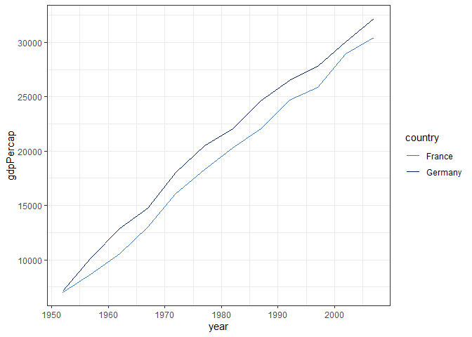

<!-- README.md is generated from README.Rmd. Please edit that file -->

# nisracolours

<!-- badges: start -->
<!-- badges: end -->

nisracolours provides accessible colour palettes for use in charts.
These palettes can be used to style charts created using ggplot2. This
is also a basic example package with functions, documentation and a
pkgdown website.

## Installation

You can install the development version of nisracolours like so:

``` r
# install.packages("pak")
pak::pak("nistatisticsresearchagency/nisracolours")
```

## Usage

The easiest way to use nisracolours is to use the
`scale_fill/colour_discrete_nisra()` functions:

``` r
library(nisracolours)
library(ggplot2)
library(gapminder)

subset(gapminder, country %in% c("Germany", "France")) |> 
  ggplot(aes(year, gdpPercap, colour = country)) +
  geom_line() +
  scale_colour_discrete_nisra() +
  theme_bw()
```


